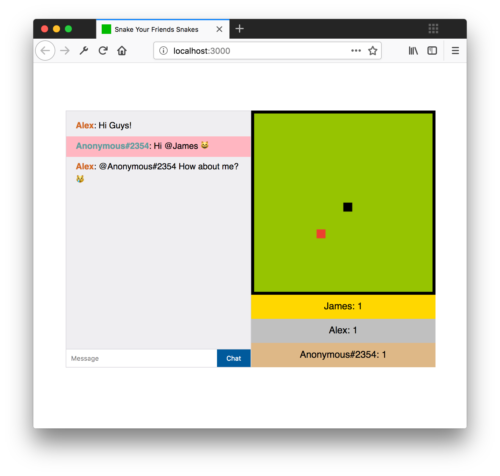

# Snake Your Friend's Snakes



## Table of Contents

## Project Description

Welcome to `Snake Your Friend's Snakes` the chat game, a multiplayer snake game where your input influences the other player's snakes as well! Here the objective is to score as many points as you can by eating the red squares/fruits while preventing your competition from doing so. Of course, you can insult your friends through the chat functionality as well!

## Getting Started

These instructions will get you a copy of the project up and running on your local machine for development and testing purposes.

### Installing

After cloning the repository you can install the required dependencies using npm:

```javascript
$ npm install
```

### Usage

In order to launch a development environment:

```javascript
$ npm start
```

## Functionality

* Have your own unique username, or do you prefer to anonymous?
* Control your own snake!
* Sabotage your friends by influencing their snake's movement
* Smack talk your opponents
* See how you and your opponents are doing through a scoreboard

## Technologies used

This application is realtime by leveraging the power of `socket.io` a web-sockets implementation for node.

Further a more, this project uses the `pug` templating language, because well, i [_really_](https://jamerrone.github.io/wafs/app/#home) like dogs.

## install/usage guide

First, ensure that you have all dependencies as specificed in the `package.json`

```
npm install
```

Then, you can go ahead and start the application by simply doing

```
npm start
```

Then, visit `localhost:3000`, send your friends a link and start _absolutely demolishing_ them.

## Controls

As the controls aren't documented, here is a simple list

| **Control** | **Command** |
| ----------- | ----------- |
| up          | /up         |
| down        | /down       |
| left        | /left       |
| right       | /right      |
