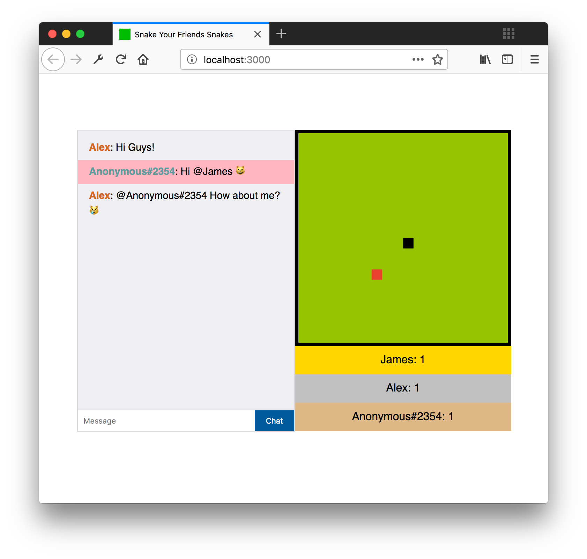

# snake your friends snakes



## Table of Contents

- [Description](#description)
- [Functionality](#functionality)
- [install/usage requirements](#installusage-requirements)
- [Technologies used](#technologies-used)
- [install/usage guide](#installusage-guide)
- [Controls](#controls)

## Description

Welcome to James `snake your friends snakes`, a multiplayer snake game where your input influences the other players aswell! Here the objective is to score as many points as you can by eating the red squares, while preventing your competetion from doing so. Ofcourse you can insult your friends through the chat functionality aswell!


## Functionality

- Have your own unique name, or do you prefer to anonymous?
- Control your own snake!
- Sabotage your friends by influencing their movement
- Smack talk your opponents
- See how you and your opponents are doing

## install/usage requirements

`npm` version used `5.6.0`
`node` version used `v8.9.4`

## Technologies used 

This application is realtime by leveraging the power of `socket.io` a web-sockets implementation for node.  

Further a more, this project uses the `pug` templating language, because well, i [*really*](https://jamerrone.github.io/wafs/app/#home) like dogs.

## install/usage guide

First, ensure that you have all dependencies as specificed in the `package.json`
```
npm install
```  
Then, you can go ahead and start the application by simply doing
```
npm start
```
Then, visit `localhost:3000`, send your friends a link and start *absolutely demolishing* them.

## Controls

As the controls aren't documented, here is a simple list

| **Control** | **Command**  |
|---------------|----------------|
| up            | /up            |
| down          | /down          |
| left          | /left          |
| right         | /right         |

